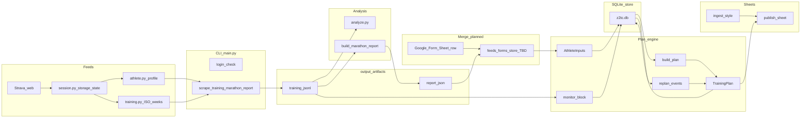

# Architecture overview

High-level map of **z2tc**: how Strava and (future) other feeds become analysis artifacts, how intake maps to the plan engine, and what is implemented vs planned.

## Layers

| Layer | Role | Code / docs |
|-------|------|----------------|
| **CLI** | User-facing commands, session lifecycle, file I/O | `main.py` |
| **Feeds** | Normalize external sources (HTTP / browser scrape) into structured records | `feeds/strava/` |
| **Analysis** | Weekly mileage, race detection, VDOT, marathon-block reports | `engine/analyze.py`, `engine/vdot.py`, `engine/paces.py` |
| **Plan engine** | `AthleteInputs` → deterministic `TrainingPlan` | `engine/plan/` |
| **Store** | SQLite + Pydantic baselines, plan artifacts, append-only events | `store/` |
| **Replan / monitor** | Event fold + prescribed-vs-actual → typed payloads | `engine/plan/replan.py`, `engine/monitor.py` |
| **LLM edge** | Typed NL/style stubs (no live provider); engine owns numbers | `llm/boundary.py` |
| **Intake contract** | Form + Strava → `AthleteInputs` merge policy (documented) | `docs/intake-and-engine.md` |
| **Render** | Sheets API: style harvest + plan tab writer | `render/runtime.py`, `render/style.py`, `render/sheets.py` |

## Data flow

Today, **merge** (Sheet + Strava → one `AthleteInputs`) is specified in `docs/intake-and-engine.md` but not implemented as a dedicated package; engineers assemble inputs manually or via ad hoc scripts. The **store** (`output/z2tc.db`) holds survey baselines, serialized plans, and the append-only event log; `main.py build-plan` / `replan` / `monitor` orchestrate persistence + engine.

## Implemented vs planned

**Implemented**

- Strava: saved session, profile scrape, ISO-week training reconstruction.
- `analyze`, `marathon-report` over `training.jsonl`-shaped data.
- Deterministic `build_plan` (Daniels / Pfitzinger / Higdon), `resolve_intake_defaults`, regression tests.
- **Second-stage MVP:** `store/` (SQLite + Pydantic), append-only `store/events.py`, `replan()`, `monitor_block()`, typed `llm/boundary.py` (stub extractor), `render/style.py` + `render/sheets.py`, and `main.py` subcommands `ingest-style`, `build-plan`, `replan`, `monitor`, `publish-sheet`.
- NYRR official results: `lib/data_feeds/nyrr.py`, `main.py nyrr-races`, and `scripts/merge_report_nyrr_survey.py` (chip times → `SurveyInputs` / VDOT with Strava `marathon-report`).

**Planned / partial**

- Full **form → store** automation (today: `build-plan --survey` loads JSON you author or export).

## Related docs

- [event-sourcing.md](event-sourcing.md) — event vocabulary ↔ engine rules.
- [interpretation-layer.md](interpretation-layer.md) — coach/LLM interpretation as events (design).
- [plan-engine.md](plan-engine.md) — dispatch, formulas, generators, tests.
- [feeds-and-analysis.md](feeds-and-analysis.md) — scrape + analyze pipeline.
- [Intake vs engine (canonical)](../intake-and-engine.md)
- [Google Form / Sheets setup](../intake-google-form.md)
- [README](../../README.md) — setup and narrative CLI walkthrough.
