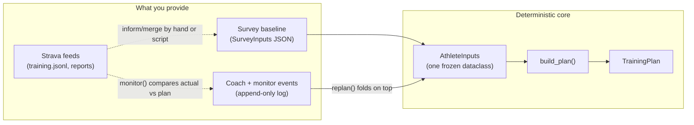
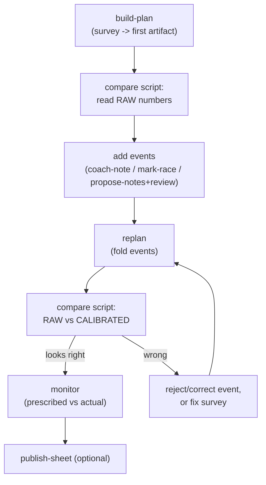

# End-to-end walkthrough: from athlete inputs to a marathon plan

This is a **learning tutorial**, not a reference. By the end you will understand:

1. the **architecture** — what each layer does and why it exists,
2. how you **provide input** (survey baseline, coach events, Strava feeds),
3. how to **run the system** one step at a time, pausing to verify, and
4. how to **read the results** at each layer and decide whether to continue or course-correct.

It uses a throwaway SQLite database and the in-repo **Kelly** fixture, so you can run it end to end with **no Strava login and no Google account**. Where a step needs real Strava/Sheets access, it is clearly marked **(needs network/auth)** and is optional.

For the canonical references this tutorial links to (don't duplicate them in your head — follow the links when you want depth):

- Layer map: [`../architecture/overview.md`](../architecture/overview.md)
- Field-by-field intake contract: [`../intake-and-engine.md`](../intake-and-engine.md)
- Event log + replan fold: [`../architecture/event-sourcing.md`](../architecture/event-sourcing.md)
- Coaching decision model: [`../architecture/athlete-readiness.md`](../architecture/athlete-readiness.md)
- CLI flags: [`../cheatsheets/01 - CLI Quick Reference.md`](../cheatsheets/01%20-%20CLI%20Quick%20Reference.md)
- Schemas: [`../cheatsheets/08 - Schemas & Config Reference.md`](../cheatsheets/08%20-%20Schemas%20&%20Config%20Reference.md)

---

## 0. The mental model (read this first)

z2tc turns an athlete's data into a **deterministic** marathon plan. "Deterministic" is the whole point: the numeric path has **no LLM**, so the *same inputs always produce the same plan*. That is what makes the plan auditable — when a number looks wrong, it came from an input or a rule, never from a dice roll.

There are three kinds of input, and keeping them straight is the key to debugging:



- **Survey baseline** → becomes `AthleteInputs` directly (a 1:1 map). This is the numeric authority.
- **Events** (coach notes, race estimates, weekly evaluations, monitor flags) are an **append-only log**. `replan()` *folds* the approved/applied ones on top of the baseline before calling `build_plan()` again.
- **Strava feeds** are *upstream*: they inform what you put in the survey (e.g. current weekly mileage) and they feed `monitor` (actual miles vs prescribed). They are **not** themselves `build_plan` inputs unless you merge them in.

The golden debugging question, any time a plan looks wrong:

> **"Would the raw baseline alone produce the same plan?"**
> If yes → the bug is in the **engine or the survey**. If no → the bug is in an **event / the fold**.

You will use that question repeatedly below.

---

## 1. The layers (architecture tour)

Full version in [`../architecture/overview.md`](../architecture/overview.md). Short version, top to bottom:

| Layer | What it does | You touch it via |
|-------|--------------|------------------|
| **CLI** (`main.py`) | Every command you run; owns file/DB I/O | `python main.py <command>` |
| **Feeds** (`feeds/strava/`) | Scrape Strava into structured weekly records | `training`, `scrape`, `marathon-report` *(needs auth)* |
| **Analysis** (`engine/analyze.py`, `vdot.py`, `paces.py`) | Weekly mileage, race detection, VDOT, paces | `analyze`, `marathon-report` |
| **Plan engine** (`engine/plan/`) | `AthleteInputs` → `TrainingPlan` (pure math) | `build-plan` (and the engine directly in tests) |
| **Store** (`store/`) | SQLite: survey baselines, plan artifacts, append-only events | every command's `--db` |
| **Replan / monitor** (`engine/plan/replan.py`, `engine/monitor.py`) | Fold events into inputs; compare prescribed vs actual | `replan`, `monitor`, `review` |
| **LLM edge** (`llm/boundary.py`) | NL → *structured proposed events* only; never NL → number | `propose-notes`, `interpret-activities` |
| **Render** (`render/`) | Write the plan into a styled Google Sheet | `ingest-style`, `publish-sheet` *(needs auth)* |

Notice the LLM sits at the **edge**. It can *propose* events from coach prose, but a human reviews them and the engine still recomputes every number. That boundary is why the plan stays deterministic.

---

## 2. Setup (one time)

From the repo root, create the 3.11–3.13 venv (Playwright + greenlet don't support 3.14 yet):

```bash
cd /Users/tanner/Documents/Projects/z2tc
python3.11 -m venv .venv
source .venv/bin/activate
pip install -r requirements.txt
# playwright install chromium   # only needed for the Strava feed steps in §8
```

Set a few shell variables so every command below is copy-paste-able. We deliberately point at an **isolated** database so nothing you do here touches real club data:

```bash
export Z2TC_ROOT="/Users/tanner/Documents/Projects/z2tc"
cd "$Z2TC_ROOT"
source .venv/bin/activate

export DB="$Z2TC_ROOT/output/tutorial.db"          # throwaway DB; delete anytime
export ATHLETE_ID="kelly-tutorial"                  # any string; it's just a primary key
export SURVEY="$Z2TC_ROOT/tests/fixtures/survey_kelly.json"
mkdir -p "$Z2TC_ROOT/output/tutorial_artifacts"     # for DB snapshots between steps
```

> **Checkpoint habit.** After each step that changes the DB, copy it:
> ```bash
> cp "$DB" "$Z2TC_ROOT/output/tutorial_artifacts/$(date +%H%M%S)_stepNN.db"
> ```
> These copies are your "save slots." If a later step goes wrong, restore the last good copy, fix the input, and replay forward — you never have to start over.

---

## 3. The input you provide: the survey baseline

Open the fixture you'll use — this is the **minimal** required input set:

```3:13:tests/fixtures/survey_kelly.json
  "name": "Kelly",
  "vdot": 43,
  "goal_marathon_s": 14100,
  "w_now": 28.0,
  "p_history": 31.0,
  "longest_run_mi": 13.0,
  "days_per_week": 4,
  "race_date": "2026-10-10",
  "block_weeks": 18,
  "race_name": "Test Marathon",
  "secondary_races": []
```

Every field maps 1:1 to `AthleteInputs` (see `SurveyInputs.to_athlete_inputs()` in [`../../store/models.py`](../../store/models.py)). The **required** fields and what they mean:

| Field | Meaning | Where it usually comes from |
|-------|---------|-----------------------------|
| `name` | Athlete display name | Form |
| `vdot` | Current fitness (Daniels VDOT) → drives all paces | A recent race, or `marathon-report` |
| `goal_marathon_s` | Goal finish time in **seconds** (14100 = 3:55:00) → marathon pace | Form goal |
| `w_now` | Current weekly mileage (~4-wk avg) | Strava |
| `p_history` | Peak weekly mileage in the last block | Strava |
| `longest_run_mi` | Recent longest run | Strava |
| `days_per_week` | Running days | Form |
| `race_date` | **Primary** A-race date (ISO) → block length + taper | Form |
| `block_weeks` | Weeks of training before the race (default 18) | Form / season |

Everything else in [`SurveyInputs`](../../store/models.py) is **optional**; blanks are resolved by `resolve_intake_defaults()` before the engine runs (e.g. `training_philosophy` defaults to `steady`). The full optional matrix and the blank-resolution policy live in [`../intake-and-engine.md`](../intake-and-engine.md) — that is the one canonical place for the field list.

**Try-it idea:** copy the fixture, change `vdot` from 43 to 48, and later compare the plans. Higher VDOT → faster prescribed paces and a higher mileage ceiling.

---

## 4. Step 1 — build the first plan

This persists the athlete + survey baseline, runs `build_plan()`, and saves a **plan artifact** in SQLite.

```bash
python main.py build-plan "$ATHLETE_ID" --survey "$SURVEY" --db "$DB"
```

**Why this step exists:** it is the boundary between "input" and "engine." It validates your JSON against `SurveyInputs`, writes the baseline row, and stores the very first `TrainingPlan` so later `replan`s have something to compare against.

**What it tests / proves:** that your survey is valid and the pure engine can build a plan from it.

**Expected output** (the artifact id is a UUID, so yours differs):

```
Saved plan artifact 7b3c…-… for athlete kelly-tutorial
```

If instead you see `Invalid survey JSON: …`, your file is missing a required field or has a bad type — fix the JSON and rerun. (`_cmd_build_plan` is in [`../../main.py`](../../main.py).)

> Snapshot the DB now (`…_step1.db`).

---

## 5. Reading the result (this is the part people skip)

The fastest way to *understand* the plan without a SQLite browser is the compare script. It loads the baseline, shows the plan numbers, and (later) shows how events change them:

```bash
PYTHONPATH=. python scripts/compare_cindy_plans.py --athlete-id "$ATHLETE_ID" --db "$DB"
```

It prints, for each method, a small table:

```
=== RAW (survey baseline only) (vdot=43.0 w_now=28.0 reentry=None) ===
method        vdot         easy   wk1_mi  peak_mi
daniels       43.0      9:38/mi      …       …
pfitzinger    43.0      9:38/mi      …       …
…
```

Plus a `CALIBRATED` block (identical to RAW until you add events) and an auto-assign `replan` summary line.

**What "good" looks like for Kelly** — sanity bands, not exact golden values:

- `vdot` matches your input (43.0). If it doesn't, an event changed it (it shouldn't have yet).
- `easy` pace is plausible for VDOT 43 (~9:30–9:45/mi).
- `wk1_mi` is near `w_now` (28) and **`peak_mi` ≥ wk1**, ramping toward `p_history`/capacity.
- The plan has about `block_weeks` (18) weeks.

If you want the raw structure, the plan is a `TrainingPlan` (see [`../../engine/plan/models.py`](../../engine/plan/models.py)): top-level `vdot`, `paces`, `peak_miles`, `block_weeks`, and a list of `weeks`, each with `target_miles`, a `phase`, and `days` of `Workout`s. `flags` are warnings; `notes` are informational rationale/citations.

**Determinism check (optional but instructive):** run `build-plan` a second time into a *fresh* DB and compare the compare-script tables — they must be identical. Same inputs, same plan.

**Course-correct here:** if the RAW numbers are wrong, the problem is your **survey** (or an engine rule), not events. Edit the JSON (e.g. fix `goal_marathon_s`) and rerun §4.

---

## 6. Step 2 — replan (folding the event log)

`replan` re-reads the baseline, **folds every approved/applied event** on top of it, and saves a new artifact.

```bash
python main.py replan "$ATHLETE_ID" --db "$DB"
```

**Expected** (zero events so far, so the plan is unchanged but a new artifact is written):

```
Saved replan artifact 9f2a…-…_e0 (events=0)
```

The `_e0` suffix and `events=0` tell you the fold saw zero events. That is the baseline case. Next we add some.

---

## 7. Step 3 — provide coach input as events

There are two ways events enter the log: **directly** (you, the coach, assert a fact) and **via the LLM edge** (prose → proposed events → you review). Both end up as rows in the append-only `events` table; the difference is only how they're authored.

### 7a. Direct coach events (no LLM)

A free-text note (provenance only — it never changes numbers by itself):

```bash
python main.py coach-note "$ATHLETE_ID" --text "Felt strong all week, sleeping well." --db "$DB"
```

An **effort-corrected race estimate** (this *does* change fitness — it computes the VDOT the effort really showed, detrains it to today, and the next `replan` folds it into `vdot`):

```bash
python main.py coach-note "$ATHLETE_ID" \
  --race-name "Spring Half" --race-date 2026-05-30 \
  --distance half --estimated-time 1:45:00 --db "$DB"
```

Tag how hard a known race was actually run (a submaximal race shouldn't set fitness):

```bash
python main.py mark-race "$ATHLETE_ID" --race-date 2026-05-30 --quality submaximal --db "$DB"
```

The event vocabulary and exactly how each one folds is owned by [`../architecture/event-sourcing.md`](../architecture/event-sourcing.md); the coaching rationale (why a sick race or a break changes VDOT) is in [`../architecture/athlete-readiness.md`](../architecture/athlete-readiness.md).

### 7b. LLM-proposed events (the NL boundary)

The LLM only turns prose into **proposed** structured events; it never writes a number into the plan. For the tutorial we force the offline **stub** so there's no network and the output is deterministic:

```bash
export Z2TC_DISABLE_GEMINI=1
export Z2TC_LLM_STUB_EVENTS_JSON='[{"kind":"WeeklyEvaluation","week_start":"2026-06-01","calibrated_vdot":45.0,"note":"tutorial calibration"}]'

python main.py propose-notes "$ATHLETE_ID" --text "Coach calibration note." --db "$DB"
```

**Expected:** it stores your raw text as a `CoachNote` and appends the stubbed `WeeklyEvaluation` as `status=proposed`. Proposed events do **not** affect the plan until approved.

> **Date grounding (Phases 5–7).** Extraction compares grounded calendar fields against a plausibility window from the race date. **Phase 7:** wildly wrong but **parseable** ISO dates are **rewritten** in the proposed payload before persistence, with a **`Date normalized …`** line on **stderr** (see [`../architecture/event-sourcing.md`](../architecture/event-sourcing.md)). **`Date flag`** on stderr is now rare for parseable dates (still possible if something remains out of window). **`!! date warning`** on **stdout** at **`review`** only applies to what is **already stored** — it does not rewrite the DB. Nothing is auto-rejected; the human gate decides.

### 7c. Review the proposals (the human gate)

```bash
python main.py review "$ATHLETE_ID" --db "$DB"
```

For each proposed event you'll see its JSON and an `[A]pprove, [R]eject, [S]kip?` prompt. If a date is out of window you'll also see an inline `!! date warning: …` on **stdout** before the prompt — verify before approving. When you approve anything, `review` runs `replan` automatically (unless you pass `--no-replan`).

Non-interactive variants (for scripts/CI; same gate, no prompts):

```bash
python main.py review "$ATHLETE_ID" --yes-all --db "$DB"             # approve all + replan
python main.py review "$ATHLETE_ID" --yes-all --no-replan --db "$DB" # approve all, don't write a new plan
```

> Snapshot the DB (`…_step3.db`).

---

## 8. Reading the result *after* events — did the right thing change?

Run the compare script again:

```bash
PYTHONPATH=. python scripts/compare_cindy_plans.py --athlete-id "$ATHLETE_ID" --db "$DB"
```

Now the **CALIBRATED** block should differ from **RAW** — and *only* in the way your events justify. With the approved `WeeklyEvaluation(calibrated_vdot=45.0)` from §7b, CALIBRATED `vdot` should read **45.0** and the paces/mileage should shift accordingly; RAW still shows 43.0.

This is the §0 golden question in action:

- RAW = "baseline alone."
- CALIBRATED = "baseline + folded events."
- If CALIBRATED is wrong but RAW is right → the bug is in an **event or the fold**, so fix the event (reject it in `review`, or add a correcting one) — *not* the survey or the engine.

**Course-correct loop:** reject a bad proposal, or append a corrected coach event, then `replan` and re-run the compare script. Because everything is event-sourced, you adjust by **adding/approving/rejecting events**, never by editing history.

---

## 9. Step 4 — monitor (prescribed vs actual) *(optional; needs a training file)*

`monitor` compares the latest plan against weekly **actual** miles from a `training.jsonl` file and logs flag events (e.g. an `AdherenceFlag` when a week falls short).

```bash
# Minimal: an empty training file is valid input and exercises the wiring.
TRAINING="$Z2TC_ROOT/output/tutorial_weeks.jsonl"
: > "$TRAINING"
python main.py monitor "$ATHLETE_ID" --training "$TRAINING" --db "$DB"
```

**Expected:** one line per logged event (`AdherenceFlag {…json…}`) and a closing `Logged N monitor event(s) for athlete kelly-tutorial`. With real Strava weeks (see §10) you'll get realistic flags; the integration test [`../../tests/test_kelly_pipeline.py`](../../tests/test_kelly_pipeline.py) asserts the `AdherenceFlag` / `Logged …` strings, which is a good reference for what healthy output looks like.

These monitor events are themselves date-bearing but are **code-generated and trusted** — they are deliberately *not* date-grounded (only LLM/coach dates are). See [`../architecture/event-sourcing.md`](../architecture/event-sourcing.md).

---

## 10. Strava feeds — where the survey numbers actually come from *(needs auth)*

Everything above used a hand-authored survey. In real use, the Strava layer produces the evidence you put into that survey (and into `monitor`). One-time login already done on this machine per project setup; verify with:

```bash
python main.py check                       # confirm the saved session works
python main.py training "$STRAVA_ID" --start 2026-02-01 --end 2026-06-01 \
  --out "$Z2TC_ROOT/output/marathon/training_${STRAVA_ID}.jsonl"
python main.py analyze \
  --in "$Z2TC_ROOT/output/marathon/training_${STRAVA_ID}.jsonl" \
  --out "$Z2TC_ROOT/output/training_summary.json"
python main.py marathon-report "$STRAVA_ID" --out-dir "$Z2TC_ROOT/output/marathon"
```

- `training` → weekly ISO records (`training.jsonl`).
- `analyze` → calendar + weekly totals (`training_summary.json`).
- `marathon-report` → per-athlete `report_<id>.json` with detected race, VDOT, paces.

Read `report_<id>.json` to pull `vdot`, recent long run, and mileage into your survey, or feed it to `fitness-select` to resolve fitness from candidate races. Behavior is owned by [`../architecture/feeds-and-analysis.md`](../architecture/feeds-and-analysis.md).

---

## 11. Step 5 — publish to a Sheet *(optional; needs auth)*

```bash
python main.py ingest-style                              # refresh cached club style (if stale)
python main.py publish-sheet "$ATHLETE_ID" --db "$DB"    # render latest artifact to a Sheet tab
```

This is the rendering layer; it reads the latest plan artifact and writes a styled tab. Nothing about the numbers changes here.

---

## 12. The whole loop, and where to pause



**Pause points** (verify before continuing):

1. After `build-plan` → compare script RAW block sane?
2. After `review`/`replan` → CALIBRATED changed *only* as events justify?
3. After `monitor` → flag counts match the training file you fed?

At each pause: snapshot the DB, read the relevant output, and only continue when it matches expectation. If not, restore the last snapshot and fix the **one** input you changed.

---

## 13. Running it all without pauses (regression / CI)

When you just want a green/red signal rather than a human walkthrough, the test suite already exercises every layer:

```bash
python -m pytest tests/test_plan.py tests/test_replan.py -q       # pure engine + fold
python -m pytest tests/test_boundary.py tests/test_hitl.py -q     # LLM edge + review gate + date grounding
python -m pytest tests/test_kelly_pipeline.py -q                  # full CLI subprocess: build-plan -> replan -> monitor, and propose -> review
bin/check-doc-refs                                                # docs cite real paths
```

The Kelly pipeline test is the closest automated analog to this tutorial. The opt-in live-Gemini test stays skipped unless you set `Z2TC_RUN_LIVE_GEMINI=1`.

---

## 14. Cheat sheet — one line per command

| Command | One-liner | Changes the plan? |
|---------|-----------|-------------------|
| `build-plan` | Survey JSON → baseline + first artifact | Yes (creates it) |
| `replan` | Fold approved/applied events → new artifact | Yes, via events |
| `coach-note` | Append a note or effort-corrected race estimate | Only after `replan` (estimate) |
| `mark-race` | Tag race effort / exclude it from fitness | Only after `replan` |
| `propose-notes` / `interpret-activities` | LLM prose → **proposed** events | No (until reviewed) |
| `review` | Approve/reject proposals; replans on approval | Yes, on approve |
| `monitor` | Prescribed vs actual miles → flag events | Adds events, not paces |
| `fitness-select` | Resolve fitness VDOT from races/directives | Writes a `FitnessAnchor` with `--apply` |
| `training` / `analyze` / `marathon-report` | Strava feeds → JSONL / summary / report | No (feeds the survey) |
| `publish-sheet` | Render latest artifact to a Google Sheet | No |

When in doubt, fall back to the §0 question — *would the raw baseline alone produce this?* — and the compare script. Those two together localize almost any surprise to a specific layer.
